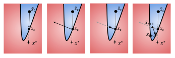
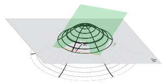
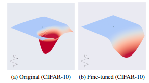

# Adversarial Defense


Experiments on CIFAR10 trained on ResNet18 to defend the network against state-of-the-art HopSkipJumpAttack (Chen *et al*).

### File Structure

```bash
├── deepfool.py		# DeepFool attack
├── hsja.py		# HSJA attack
├── models
│   ├── base
│   │   └── ckpt.pth	# pretrained standard model
│   └── curvature
│       ├── CURE.py	# main defense implementation
│       └── robust.pth	# defended model
├── resnet.py		# Resnet architecture definitions
├── train.py		# train to defend against attacks
└── utils
    └── utils.py	# utility functions
```


### Attacks

Decision based (black-box) Hop Skip Jump Attack (Chen *et al*)

```bash
python hsja.py --model base --iter 10
```




One can also how well does a white-box attack like DeepFool (Moosavi *et al*) perform



```ba
python deepfool.py --model base --iter 10
```


### Defense

The idea is to analyze HSJA assumptions and increase the curvature of the boundary inspired by Curvature regularization (Moosavi *et al*) 

```bash
python train.py --epochs 40 --batch_size 128 --lr 0.0001
```

The above command would re-train the model with the aim to increase boundary curvature hoping the attack to fail



*Images courtesy: Moosavi et al, Chen et al*

### References

- Chen, Jianbo, Michael I. Jordan, and Martin J. Wainwright. "[HopSkipJumpAttack: A query-efficient decision-based attack](https://arxiv.org/pdf/1904.02144.pdf)." *IEEE Symposium on Security and Privacy (SP). IEEE, 2020.*
- Moosavi-Dezfooli, Seyed-Mohsen, et al. "[Robustness via curvature regularization, and vice versa](https://openaccess.thecvf.com/content_CVPR_2019/papers/Moosavi-Dezfooli_Robustness_via_Curvature_Regularization_and_Vice_Versa_CVPR_2019_paper.pdf)" *Proceedings of the IEEE Conference on Computer Vision and Pattern Recognition*. 2019.
- Moosavi-Dezfooli, Seyed-Mohsen, Alhussein Fawzi, and Pascal Frossard. "[Deepfool: a simple and accurate method to fool deep neural networks](https://arxiv.org/pdf/1511.04599.pdf)" *Proceedings of the IEEE conference on computer vision and pattern recognition*. 2016.
